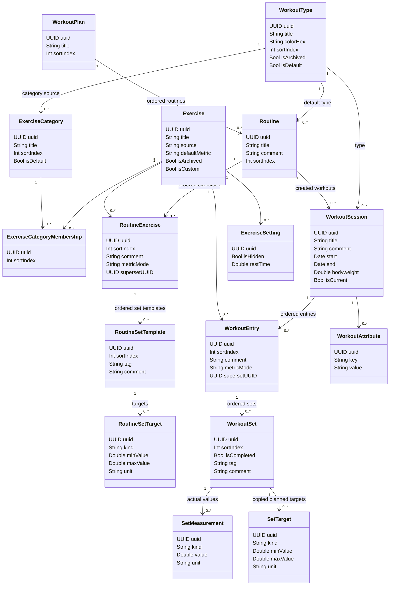
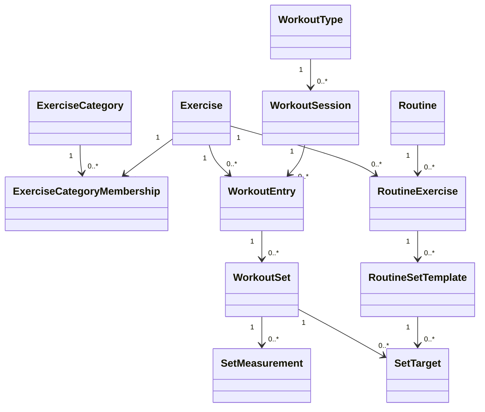

# Workout data model redesign

This note describes a cleaner future Core Data model for Forge. The current model is workable, but it is starting to stretch as workout types move beyond strength training. The main issue is that `WorkoutSet` keeps gaining optional fields for every measurement style: reps, weight, duration, distance, targets, RPE, and bodyweight handling.

Because Forge is currently used by one person, this is the right time to consider a breaking cleanup instead of carrying awkward compatibility forever.

## Current strengths

The existing model has several good foundations:

- Logged workouts are separate from routine templates.
- Workouts, exercises, sets, routines, and plans use stable UUIDs.
- Ordered relationships preserve workout and routine order.
- Deleting a routine does not delete historical workouts.
- Workout types are editable and can be archived without rewriting old workouts.

Those parts should stay.

## Current problems

The model is becoming harder to extend in a few places:

- `WorkoutSet` has too many optional measurement columns.
- Strength-specific assumptions leak into non-strength workouts.
- Built-in exercises live in JSON while custom exercises live in Core Data.
- One exercise can appear in several categories, but the model does not represent category membership directly.
- Flexible data stored as JSON strings is useful for compatibility, but hard to query and validate.
- UUID uniqueness is mostly enforced by code and tests, not by model constraints.

## Design goals

The redesigned model should support:

- Strength sets with reps, weight, RPE, tags, comments, and targets.
- Time-based exercises such as planks, rounds, tennis drills, mobility holds, or cardio intervals.
- Distance-based exercises such as treadmill, running, rowing, cycling, SkiErg, or StairMaster.
- Exercises appearing in multiple categories while remaining one exercise entry.
- Built-in and custom exercises using the same persistence shape.
- Historical workouts staying stable even when routines or exercise categories change later.

## Improved UML



## Key improvements

### Make Exercise a persisted entity

Built-in and custom exercises should use the same `Exercise` entity.

Current model:

- Built-in exercises are JSON catalog entries.
- Custom exercises are Core Data rows.
- Workouts and routines store only `exerciseUuid`.

Improved model:

- Built-in exercises are seeded into Core Data with stable UUIDs.
- Custom exercises are also Core Data rows.
- `Exercise.isCustom` distinguishes user-created exercises.
- `Exercise.source` can identify built-in catalog source or user source.

This removes the split between built-in and custom exercises and makes filtering, archiving, search, and category membership easier.

### Add ExerciseCategoryMembership

One exercise should be able to appear in multiple sections while remaining one exercise.

Example:

```text
SkiErg
  categories: Cardio, Strength, Conditioning
```

With `ExerciseCategoryMembership`, this is one `Exercise` row and several membership rows. Previous workout references still point to the same exercise UUID.

### Make WorkoutSet generic

The current `WorkoutSet` stores many optional fields directly:

```text
repetitions
weight
duration
distance
rpe
targetWeight
targetRpe
minTargetRepetitions
maxTargetRepetitions
minTargetDuration
maxTargetDuration
targetDistance
```

The improved model keeps the set itself small:

```text
WorkoutSet
  uuid
  sortIndex
  isCompleted
  tag
  comment
```

Actual values move into `SetMeasurement`.

Strength example:

```text
WorkoutSet
  SetMeasurement(kind: reps, value: 8, unit: count)
  SetMeasurement(kind: weight, value: 35, unit: kg)
  SetMeasurement(kind: rpe, value: 8, unit: rpe)
```

Timed exercise example:

```text
WorkoutSet
  SetMeasurement(kind: duration, value: 60, unit: sec)
```

Cardio example:

```text
WorkoutSet
  SetMeasurement(kind: duration, value: 45, unit: min)
  SetMeasurement(kind: distance, value: 5, unit: km)
```

Weighted timed exercise example:

```text
WorkoutSet
  SetMeasurement(kind: duration, value: 60, unit: sec)
  SetMeasurement(kind: weight, value: 10, unit: kg)
```

This avoids adding another optional column every time Forge supports a new workout style.

### Separate targets from actual values

Targets should be stored separately from completed values.

Routine templates use `RoutineSetTarget`:

```text
RoutineSetTarget(kind: reps, minValue: 8, maxValue: 12, unit: count)
RoutineSetTarget(kind: weight, minValue: 80, maxValue: nil, unit: kg)
```

Logged workouts copy those into `SetTarget`, then actual values are stored in `SetMeasurement`.

This preserves what the routine expected at the time the workout started, even if the routine changes later.

### Keep WorkoutSession separate from Routine

`WorkoutSession` should keep an optional link to the routine that created it, but it should not depend on that routine for historical display.

Important historical fields should be snapshotted onto the workout:

- workout title
- workout type
- routine title, if used for display
- plan title, if used for display
- copied set targets

This keeps History readable after a routine is renamed, moved, archived, or deleted.

## Suggested simplified Core Data model

If the full model feels too large, this smaller version would still solve most problems:



This is the model I would use if the goal is to keep Forge flexible without overbuilding.

## Migration direction

A full migration can be done in stages.

### Stage 1: Persist exercises

Create `Exercise` rows for every built-in and custom exercise.

Map current references:

```text
WorkoutExercise.exerciseUuid -> Exercise.uuid
WorkoutRoutineExercise.exerciseUuid -> Exercise.uuid
ExerciseSettings.exerciseUuid -> Exercise.uuid
```

Keep UUIDs unchanged.

### Stage 2: Add categories

Create default categories from workout types and activity sections:

- Strength
- Tennis
- Martial arts
- Cardio
- Mobility
- Other

Then seed `ExerciseCategoryMembership` rows.

### Stage 3: Introduce generic measurements

For each existing `WorkoutSet`:

- `repetitions` becomes `SetMeasurement(kind: reps, unit: count)`.
- `weight` becomes `SetMeasurement(kind: weight, unit: kg)`.
- `duration` becomes `SetMeasurement(kind: duration, unit: sec)`.
- `distance` becomes `SetMeasurement(kind: distance, unit: km)` or the current internal unit.
- `rpe` becomes `SetMeasurement(kind: rpe, unit: rpe)`.

For targets:

- `minTargetRepetitions` and `maxTargetRepetitions` become `SetTarget(kind: reps)`.
- `minTargetDuration` and `maxTargetDuration` become `SetTarget(kind: duration)`.
- `targetDistance` becomes `SetTarget(kind: distance)`.
- `targetWeight` becomes `SetTarget(kind: weight)`.
- `targetRpe` becomes `SetTarget(kind: rpe)`.

### Stage 4: Remove old optional columns

Once the UI reads from `SetMeasurement` and `SetTarget`, remove the old measurement columns from `WorkoutSet` and `WorkoutRoutineSet`.

## Recommendation

Do not do a broad migration casually. The current model is not broken.

But if Forge is going to support tennis, martial arts, cardio, mobility, and strength under the same app, the improved model is cleaner. The most important change is the generic measurement layer. It prevents every new workout style from turning into another optional column on `WorkoutSet`.

